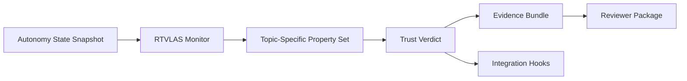

# DAF26BZ01-DV007 CHORD

[](proposal/02_Technical_Volume.md)
[](core/src/lib.rs)
[](bindings/include/rt_vlas.h)
[](evidence/)
[](scripts/prepare_package.sh)

This repository packages **RTVLAS** for **DAF26BZ01-DV007 CHORD** as a **autonomy black-box recorder; decision review layer; operator trust and mission reconstruction tool**.

> RTVLAS adapted into a traceable mission-review system that reconstructs autonomy decisions, scores trust over time, and exposes exactly why a mission sequence should be questioned by an operator or evaluator.

**End product form:** Traceable mission-review software that ingests autonomy outputs and produces operator-reviewable evidence with a static HTML viewer, replay tooling, and structured proof logs.
**Solicitation track:** Direct-to-Phase-II style topic (confirm against official DSIP release at submission time)

## Reviewer Start

- [Submission Index](proposal/00_Submission_Index.md)
- [Executive Summary](proposal/01_Executive_Summary.md)
- [Technical Volume](proposal/02_Technical_Volume.md)
- [Reviewer Guide](proposal/04_Reviewer_Guide.md)
- [Claim / Artifact Matrix](proposal/05_Claim_Artifact_Matrix.md)
- [Risk Register](proposal/07_Risk_Register.md)
- [Data Provenance](proposal/08_Data_Provenance.md)
- [Solicitation Alignment](proposal/09_Solicitation_Alignment.md)
- [Submission Checklist](proposal/10_Submission_Checklist.md)
- [Required Inputs](proposal/11_Required_Inputs.md)
- [Docs Index](docs/README.md)
- [Evidence Guide](evidence/README.md)
- [Evidence Summary](evidence/scorecard_summary.md)
- [Package Manifest](package_manifest.json)

## Why This Repo Exists

RTVLAS is not positioned here as the autonomy stack. It is positioned as the **runtime trust layer**
that independently monitors autonomy outputs, applies topic-specific safety and mission properties,
and emits structured evidence for operator review, recovery logic, and technical due diligence.

## Solicitation Focus This Repo Targets

- common ingest for autonomy outputs, human interaction records, and mission context
- map, timeline, event-log, and status playback for post-mission review
- operator-facing reconstruction of why a collaborative autonomy sequence succeeded or failed
- data format and visualization discipline that reduces bespoke debrief tooling burden

## System Shape



## Evidence Snapshot

| Scenario | Expected Outcome |
| --- | --- |
| [Clean Human-ACP Debrief](evidence/scenario_01_clean_mission_review/trust_scorecard.json) | Well-instrumented collaborative autonomy timeline with stable human intent alignment and complete evidence. |
| [Commander Intent Divergence](evidence/scenario_02_operator_mismatch/trust_scorecard.json) | Autonomy diverges from commander intent during a late replan, generating reviewable trust erosion without full replay failure. |
| [Broken Debrief Chain](evidence/scenario_03_evidence_gap_chain/trust_scorecard.json) | Mission replay suffers severe evidence gaps and invalid mission-plan state, forcing a reject-grade operational review outcome. |

## One Command Rebuild

```bash
./scripts/prepare_package.sh
```

Rebuild output:

- regenerated `evidence/`
- regenerated `evidence/scorecard_summary.md` and `package_manifest.json`
- refreshed `submission_package/`
- rebuilt Rust workspace and tests

## Current Evidence Boundaries

This package is intentionally honest about maturity. Current evidence is based on deterministic,
topic-shaped autonomy traces generated inside this repository for repeatable feasibility or readiness review.
See [proposal/08_Data_Provenance.md](proposal/08_Data_Provenance.md) and [package_manifest.json](package_manifest.json).

## Repository Map

- [core/](core/): runtime monitor, property framework, evidence writer
- [bindings/](bindings/): C ABI for external autonomy stacks
- [tooling/](tooling/): replay, evaluation, and optional viewer tooling
- [evidence/](evidence/): pre-generated artifacts for all scenarios
- [proposal/](proposal/): reviewer-facing submission package
- [docs/](docs/): architecture and API references
- [scenarios/](scenarios/): deterministic input traces used to generate evidence
- [scripts/](scripts/): package rebuild and scenario execution
