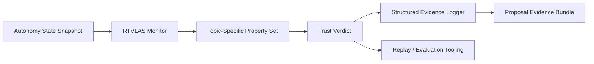

# Architecture

This repository adapts RTVLAS for **DAF26BZ01-DV007 CHORD**.

## System Role

**Opening angle:** autonomy black-box recorder; decision review layer; operator trust and mission reconstruction tool

## Runtime Elements

- `core/`: monitor, property framework, evidence writer
- `bindings/`: C ABI for external autonomy stacks
- `tooling/replay/`: deterministic replay of autonomy traces
- `tooling/eval/`: scenario evaluator and artifact generation
- `evidence/`: pre-generated scenario outputs for reviewers

## Topic Adaptation

The property set in this repository is tuned for:

- Decision Chain Latency Bound
- Human-ACP Intent Alignment
- Debrief Evidence Completeness
- Mission Reconstruction Validity
- Collaborative Timeline Continuity
