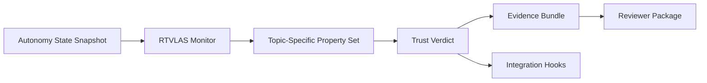

# Technical Volume

## 1. Technical Thesis

The proposal opens with the following angle: **autonomy black-box recorder; decision review layer; operator trust and mission reconstruction tool**.

RTVLAS is not proposed here as the primary autonomy engine. It is proposed as the supervisory runtime layer that determines when autonomy outputs should no longer be trusted. That positioning is well matched to the current submission posture because it focuses on interface definition, safety property construction, and low-order scenario evidence rather than expensive airworthiness-scale integration.

## 2. Solicitation-Specific Fit

**Track posture:** Direct-to-Phase-II style topic (confirm against official DSIP release at submission time)

**Objective fit:** Provide a common operational review capability that fuses ACP and human decision data into shared playback, event, map, and status products for mission debrief and trust assessment.

This repository is explicitly shaped around the following solicitation needs:

- common ingest for autonomy outputs, human interaction records, and mission context
- map, timeline, event-log, and status playback for post-mission review
- operator-facing reconstruction of why a collaborative autonomy sequence succeeded or failed
- data format and visualization discipline that reduces bespoke debrief tooling burden

**Deliberate scope boundary:** This repository focuses on evidence ingest, timeline reconstruction, and reviewer playback rather than developing new autonomy behaviors.

## 3. Problem

Operational teams need a fast way to reconstruct autonomy decisions, operator interactions, and timeline anomalies without relying on opaque logs or bespoke mission replay tooling.

## 4. Proposed Solution

RTVLAS adapted into a traceable mission-review system that reconstructs autonomy decisions, scores trust over time, and exposes exactly why a mission sequence should be questioned by an operator or evaluator.

The prototype consists of:

- a Rust runtime monitor that ingests autonomy state snapshots
- a property framework that evaluates topic-specific trust rules
- a structured evidence logger that writes JSON scorecards and human-readable proof logs
- replay and evaluation tooling for deterministic verification
- a C ABI that supports integration with existing autonomy stacks written in C or C++

## 5. Architecture

## 6. Topic-Specific Safety / Trust Properties

- **Decision Chain Latency Bound**: Flags autonomy or human-decision records that arrive too late to remain operationally meaningful during playback and review.
- **Human-ACP Intent Alignment**: Tracks how closely the observed autonomy actions remain aligned with the human commander's stated intent or review rubric.
- **Debrief Evidence Completeness**: Ensures enough mission context and state are present to support a defensible collaborative autonomy debrief.
- **Mission Reconstruction Validity**: Detects when the replay chain is operating against an invalidated or incomplete mission-plan model during reconstruction.
- **Collaborative Timeline Continuity**: Captures dropped, duplicated, or significantly delayed decision events that break collaborative mission timeline continuity.

## 7. Preliminary Feasibility Evidence

This repository includes three deterministic scenarios that exercise both nominal and non-nominal behavior:

- **Clean Human-ACP Debrief**: Well-instrumented collaborative autonomy timeline with stable human intent alignment and complete evidence.
- **Commander Intent Divergence**: Autonomy diverges from commander intent during a late replan, generating reviewable trust erosion without full replay failure.
- **Broken Debrief Chain**: Mission replay suffers severe evidence gaps and invalid mission-plan state, forcing a reject-grade operational review outcome.

For each scenario, the package generates:

- `trust_scorecard.json`
- `timeline.json`
- `proof_log.txt`
- `trace.svg`

These artifacts provide preliminary data supporting the claim that the monitor can detect degraded or unsafe autonomy behavior while preserving a replayable evidence trail.

## 8. Differentiators

- low-compute runtime implementation in Rust
- clear C ABI for autonomy-stack integration
- property-based monitoring rather than opaque post hoc anomaly scoring
- deterministic replay and evidence regeneration
- direct claim-to-artifact traceability for reviewers

## 9. Execution Posture

The immediate objective is to mature this repository from a topic-tuned software prototype into a reviewer-verifiable package that defines architecture, interfaces, monitoring rules, evidence products, and a concrete path to next-phase integration.

## 10. End State

A code-first decision review layer that reconstructs autonomy intent, trust transitions, and evidence sufficiency for operational review boards.

## 11. Transition Path

Connect CHORD evidence generation to live autonomy buses, expand the operator review surface, and integrate with mission analysis/debrief workflows.
